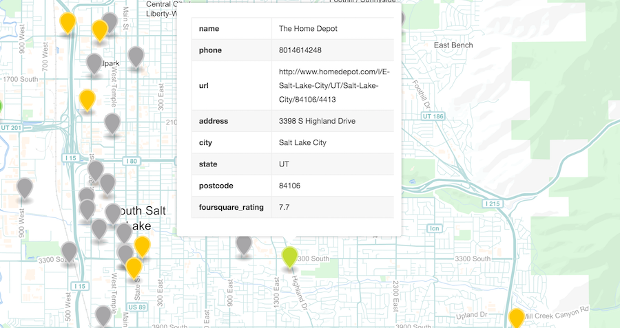

# mapsquare
_Get GeoJSON from the [Foursquare venues API](https://developer.foursquare.com/docs/venues/explore)_

## Installation

`npm install mapsquare -g`

## Usage

`mapsquare -l <placename> -q <venue keyword query> -a <Foursquare authorization token> -g`

### Arguments

* `-l, --location` (_REQUIRED_) A placename for the venue search (e.g. 'Salt Lake City, UT')
* `-q, --query` (_REQUIRED_) A venue type keyword (e.g. 'hardware' or 'movie theater')
* `-a, --auth` (_REQUIRED_) Foursquare authorization token. [Get a convenience token for testing here](https://developer.foursquare.com/docs/explore#req=venues/explore%3Fnear%3DSalt+Lake+City,+UT%26query%3Dpark) (Foursquare login or signup required).
* `-g, --gist` (_OPTIONAL_) Flag to output results as an anonymous gist

### Notes

- Limited to 50 venues per request - Foursquare will choose these based on ratings and relevance, not necessarily by proximity
- Be sure to fork the gist outputs ([like this one](https://gist.github.com/anonymous/6c25841756efc86c84c6b615e0279d8c)) to your own github account

## License

MIT